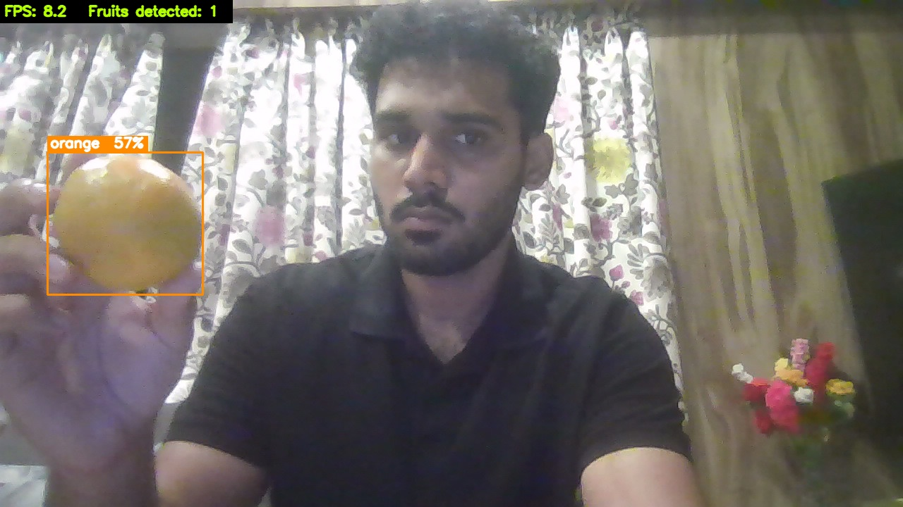
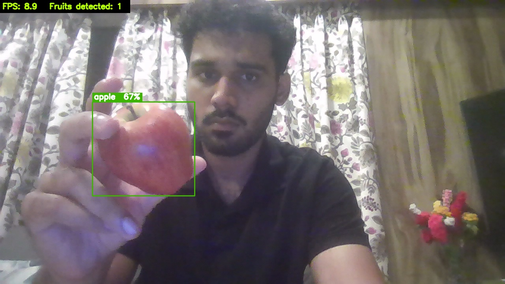
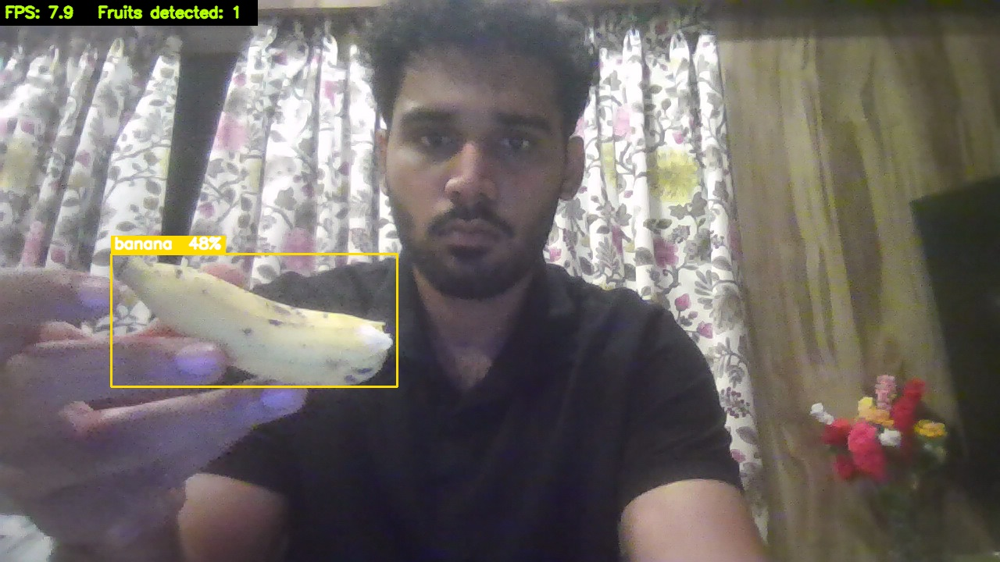

# Fruit Detector using YOLOv8 + OpenCV

A computer vision project I built to learn about object detection. It uses your laptop's webcam to detect fruits in real time and draws a labeled box around each one.

---

## What it does

Point your webcam at an apple, banana, or orange and the program will:
- Draw a rectangle around the fruit
- Label it with the fruit name
- Show the confidence score (how sure the model is)
- Display live FPS in the corner

---

## Why I built this

I wanted to get hands-on with computer vision and understand how object detection actually works under the hood — not just read about it. This felt like a good starting project because fruits are simple, distinct objects that are easy to test with.

---

## Demo

| Banana (48%) | Apple (67%) | Orange (57%) |
|---|---|---|
|  |  |  |

> Each fruit gets a colour-coded bounding box — yellow for banana, green for apple, orange for orange.

---

## Tech Stack

| Tool | What I used it for |
|------|--------------------|
| Python | Main language |
| OpenCV | Webcam feed + drawing boxes |
| YOLOv8 (ultralytics) | Running the detection model |
| COCO dataset | Pre-trained weights the model came with |

---

## How to run it

**1. Clone the repo**
```bash
git clone https://github.com/yourusername/fruit-detector.git
cd fruit-detector
```

**2. Install dependencies**
```bash
pip install ultralytics opencv-python
```
> The first run will automatically download the YOLOv8n model (~6 MB)

**3. Run**
```bash
python fruit_detector.py
```

---

## Controls

| Key | Action |
|-----|--------|
| Q | Quit |
| S | Save a screenshot to the `screenshots/` folder |

---

## Detectable fruits

Right now the model can detect **3 fruits**:
- 🍎 Apple
- 🍌 Banana
- 🍊 Orange

This is a limitation of the COCO dataset that YOLOv8 was trained on — it only includes these 3 fruits. To detect more (like grapes or strawberries) you'd need to train the model on a custom dataset, which is something I want to explore next.

---

## Things I learned

- How COCO class IDs work and why detection models use numbers instead of names
- The difference between model confidence and actual accuracy
- How OpenCV handles live video frame by frame
- Why pre-trained models are so useful — I didn't have to collect or label any data myself

---

## Possible improvements

- Add support for more fruits using a custom-trained model
- Build a simple GUI instead of running from terminal
- Count how many of each fruit appear on screen
- Try YOLOv8s (small) for better accuracy at the cost of speed

---

## Issues / Troubleshooting

**Webcam not opening?**
Change `WEBCAM_INDEX = 0` to `1` or `2` at the top of `fruit_detector.py`

**Too many wrong detections?**
Raise `CONFIDENCE_MIN` from `0.45` to something like `0.60`

**Running slow?**
Lower `FRAME_WIDTH` and `FRAME_HEIGHT` in the config section

---

*Built as a learning project. Feel free to use or modify it.*
